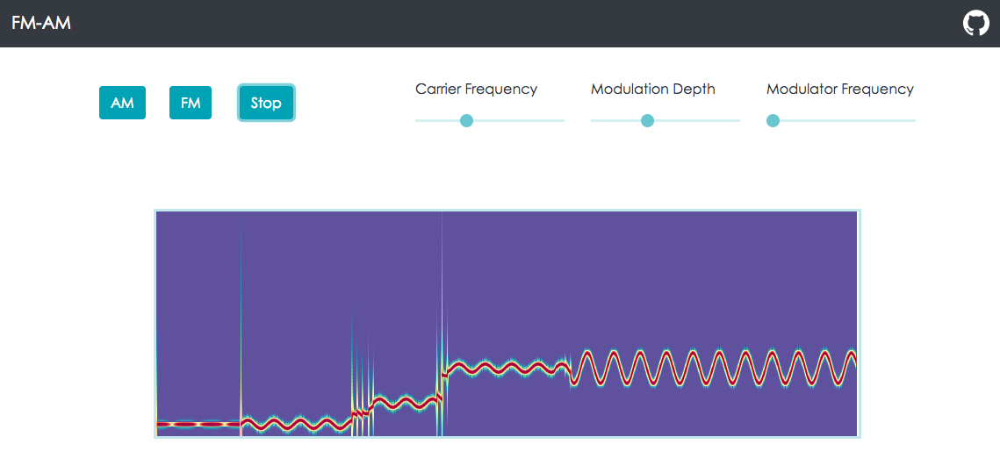

Try the [demo](http://fm-am.auditory.fr/) and experience FM and AM through visualization and audio!

In AM and FM a signal is modulated by another signal named carrier. The demo use two sinusoids as the signal and the carrier. It is possible to experience the effect of changing the frequencies of these two sinusoids in real time.

